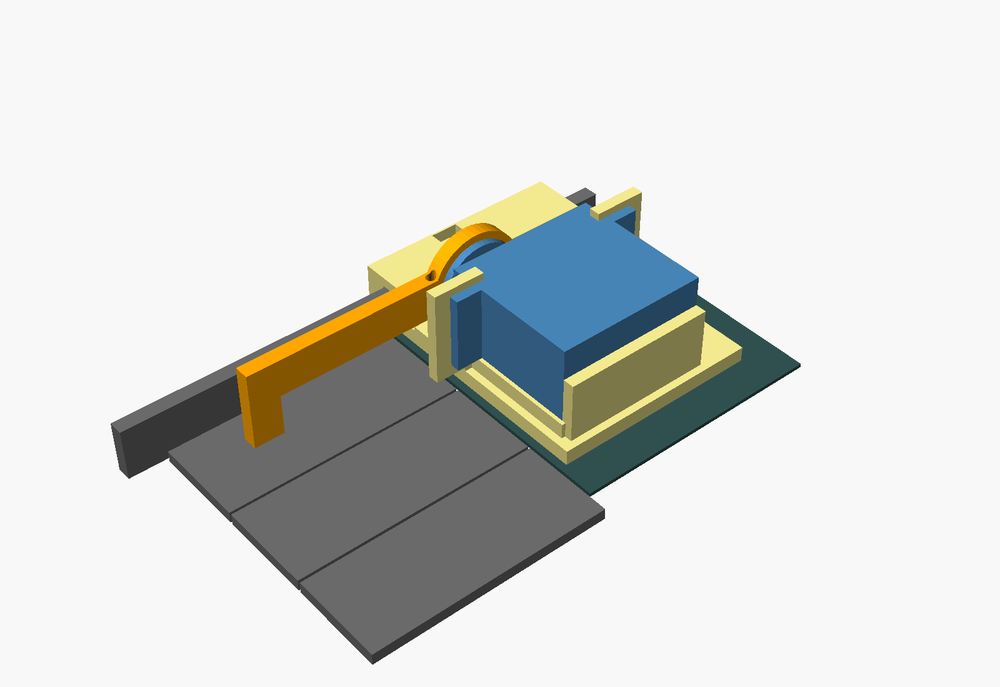
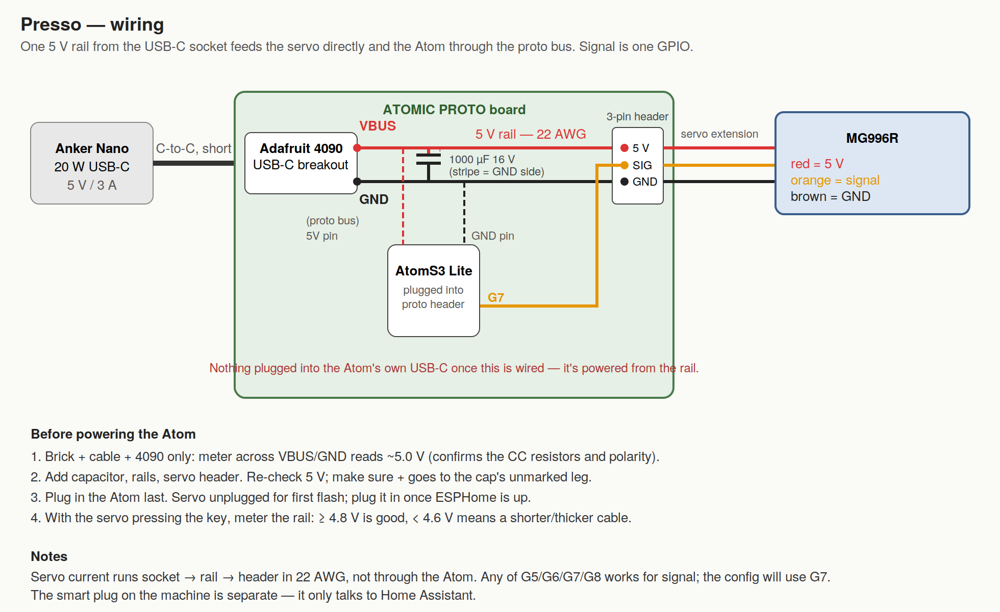

# Presso

Gravimetric shot control for the **Fellow Espresso Series 1** — without opening the machine.

A small servo sits on top of the Series 1 and taps the espresso key. An ESP32 running
[ESPHome](https://esphome.io) talks to an **Acaia Lunar** over Bluetooth, watches the weight,
and taps the key again when the shot hits your target. It learns the drip offset after each
shot, notices shots you start by hand, and everything is exposed to Home Assistant.

The Series 1 has no scale integration of its own (as of firmware 2.3.x). This gets you
stop-at-weight today, for about $60 in parts, with zero warranty exposure — the mount clamps
to a lip on the case and lifts off in a second.

> **Built with Claude.** The mount, firmware, wiring, and most of this README were designed and
> written by [Claude](https://claude.ai) (Anthropic) in conversation with Brian, who did the
> measuring, soldering, printing, and testing. The Acaia BLE protocol handling is ported from
> Tate Mazer's [AcaiaArduinoBLE / shotStopper](https://github.com/tatemazer/AcaiaArduinoBLE) —
> go star that project.

## How it works

1. You put the cup on the scale (Lunar auto-tare handles zeroing) and press **Pull shot** —
   in Home Assistant or with the button on the Atom.
2. Presso tares, starts the scale timer, and taps the espresso key.
3. It watches weight and flow rate. When `weight + flow × latency ≥ target − offset`, it taps
   the key again. It only ever presses while coffee is still flowing: if the machine ends the shot
   on its own (volumetric target, or you pressed the key), Presso stands down rather than pressing
   into a stopped machine — which would start a *new* shot.
4. Three seconds after the stop it reads the settled weight and nudges the offset by the error,
   so the second or third shot lands on target.

Start the shot by hand instead and Presso notices the weight climbing and takes over the stop.

There's also a bare **Press key** button, which a Home Assistant automation uses to wake the
machine to warm up — guarded by a power-monitoring smart plug so it only presses when the machine
is actually asleep.

## Parts

Prices are rough US retail, Sept 2026.

| Part | Notes | ~$ |
|---|---|---|
| [M5Stack AtomS3 Lite](https://shop.m5stack.com/products/atoms3-lite-esp32s3-dev-kit) | ESP32-S3, BLE + Wi-Fi, 24 mm cube | 8 |
| [M5Stack ATOMIC PROTO Kit](https://shop.m5stack.com/products/atomic-proto-kit) | Perfboard + case that the Atom clips onto | 4 |
| MG996R servo | Metal gear, ~10 kg·cm. Overkill in torque, which is why there's a hard stop | 6 |
| [Adafruit USB Type-C Breakout #4090](https://www.adafruit.com/product/4090) | Has the 5.1 kΩ CC resistors, so a USB-C PD brick gives 5 V/3 A | 3 |
| Anker Nano 20 W USB-C charger | Any 5 V/3 A USB-C brick. Don't power the servo from the Atom's own USB port | 12 |
| Short USB-C to USB-C cable | ≤ 1 m, 60 W-rated is plenty | — |
| 1000 µF 16 V electrolytic capacitor | Across the 5 V rail, soaks up the servo's start-up spike | 1 |
| 3-pin male header + servo extension cable | Header solders to the proto; extension reaches the mount | 3 |
| 22 AWG silicone wire | For the 5 V / GND run to the servo header | — |
| Screws | 4× M3×10 + nuts (servo ears), 1× M4×16 + nut (lip clamp), 1× M3×20 + nut (hard stop), M2 horn screws from the servo bag | 3 |
| ~60 g PETG | Two printed parts | 2 |
| Scrap of TPU or a silicone bumper | Pad on the arm tip; felt inside the lip clamp | — |

Optional:

| Part | Notes |
|---|---|
| Eve Energy (Matter/Thread) or Kasa KP125M | Power-monitoring smart plug on the machine — lets Home Assistant know whether it's asleep, which the wake automation needs |
| Grove-to-Dupont cable | If you'd rather not solder to the proto at all |

## Build

### 1. Print

`hardware/presso_base.stl` and `hardware/presso_arm.stl`, PETG.

- Base: as exported, flat. 4 walls, 30 % infill, no supports.
- Arm: as exported (lying flat, horn pocket up). 5 walls or 100 % infill — it's a 60 mm cantilever taking 300 g.

Everything is parametric in `hardware/presso_mount.scad` (OpenSCAD). The measurements at the top
are from one Series 1; if yours differs, change the numbers and re-export. Do a PLA fit check of
the base first — `lip_slot_clear` and `key_rear_clear` are the two most likely to need a nudge.

**How the mount sits.** The base rests on the warming mat directly behind the keys. Its outboard
end straddles the raised lip on the side of the machine; an M4 bolt through the outer wall pinches
that lip. That clamp is what stops the whole thing lifting when the servo pushes down — the press
force is larger than the mount weighs. The servo lies on its side on a riser, shaft toward the lip,
body stretching across behind the other two keys. The arm bolts to the round horn and reaches
forward over the espresso key; a pad at the tip lands 18 mm from the key's front edge.

**Hard stop.** An M3 screw threads vertically through the arm near the hub, tip down. At full key
press it touches a landing pad on the base. Set it so the key just bottoms out; the stop, not the
servo, should define the end of travel. The MG996R can crack the fascia if it's ever asked for too
much angle.

### 2. Wire

One 5 V rail from the USB-C breakout feeds the servo directly and the Atom through the proto
board's 5V pin. Signal is one GPIO (G7 by default). Seven connections total; the diagram has the
checklist. The two rules: servo current goes through your own 22 AWG wire, not through the Atom's
header pins; and check for ~5 V at the breakout with only the brick attached before soldering
anything else to it.

Notes from the build:
- Leave the breakout's pin header off — you only need VBUS and GND, so solder wires to those two
  pads and hot-glue the board wherever the socket can poke through the case.
- Solder the servo header with the **long** side up. The servo plug's contacts are recessed and
  need the full pin length.
- The Atom's own USB-C port is only for the first flash. After that it's powered from the rail.

### 3. Flash

- Copy `firmware/secrets.example.yaml` to `firmware/secrets.yaml` and fill it in.
- Find your Lunar's Bluetooth address: uncomment the `on_ble_advertise` block in `presso.yaml`,
  flash, turn the scale on, and watch the logs for `name='LUNAR-…'`. (iOS hides BLE addresses,
  so nRF Connect on an iPhone can't tell you.) Put it in `scale_mac`, remove the block, reflash.
- First flash is over USB: hold the Atom's side reset button ~2 s until the LED goes green, then
  install from the ESPHome dashboard. Everything after that is OTA over the encrypted API.
- **Servo unplugged for the first flash.** Plug it in once ESPHome is running; it's safe to
  hot-plug after that because the firmware detaches the servo at boot and after every press.

### 4. Tune

All of this is done from Home Assistant, with the mount off the machine first.

1. `Servo rest position` moves the servo live. Find rest = arm level.
2. Set `Servo press position` a little past where the pad would bottom the key and hit
   **Press key**. Wrong direction? Flip the sign. The arm only needs ~6°.
3. Mount on the machine with it *asleep* (a press just wakes it). Creep the press position toward
   the key until it registers, set the hard-stop screw to touch at that angle, back the press
   position off a hair past it.
4. Scale on: `Scale connected` should turn on within ~10 s and `Scale weight` should track.
   If it connects but never updates, raise the delay at the top of the `scale_init` script to 3 s.
5. First shot. Watch `Shot state`. Two or three shots and `Stop offset` settles.

### 5. Home Assistant

`homeassistant/automations.yaml` has a template sensor for "machine is awake" (from the smart
plug's power reading), the guarded wake automation, a safety that aborts shot logic if a press
happened while the machine was asleep, and a logbook entry per shot. Swap in your plug's power
entity and your phone's notify service.

## Entities

| | |
|---|---|
| **Buttons** | Pull shot · Press key · Tare scale · Abort shot logic |
| **Numbers** | Target weight · Stop offset · Stop latency · Servo rest / press position · Press hold time · Max shot time |
| **Switches** | Auto-stop manual shots · Learn offset |
| **Sensors** | Scale weight · Flow rate · Shot time · Last shot weight · Shot state · Scale connected · Brewing |

Atom button: tap = Pull shot, hold 1 s = Press key. LED: blue idle, green brewing, dim red = no scale.

## Caveats

- The machine's own volumetric target must be *higher* than your weight target, or the two race
  and the machine wins (Presso then correctly does nothing).
- If you deliberately stop a shot short by hand, turn `Learn offset` off first, or it'll shift the
  offset the wrong way. Errors over 5 g are ignored automatically.
- A servo on a coffee machine is a servo on a coffee machine. Keep the hard stop set, keep the
  clamp snug, and don't leave it unattended with `Auto-stop manual shots` on until you trust it.
- Fellow have said scale integration is on their radar. If they ship it, this repo becomes a
  nice paperweight. Until then.

## Credits

- Acaia BLE protocol: [tatemazer/AcaiaArduinoBLE](https://github.com/tatemazer/AcaiaArduinoBLE)
  (public domain). The identify/heartbeat/notification packets and the weight-packet parsing are
  taken directly from it, and the stop-early-then-learn-the-offset approach is the shotStopper's.
- Design, firmware, and docs: Claude (Anthropic), with Brian Krausz.

## License

MIT — see [LICENSE](LICENSE).
